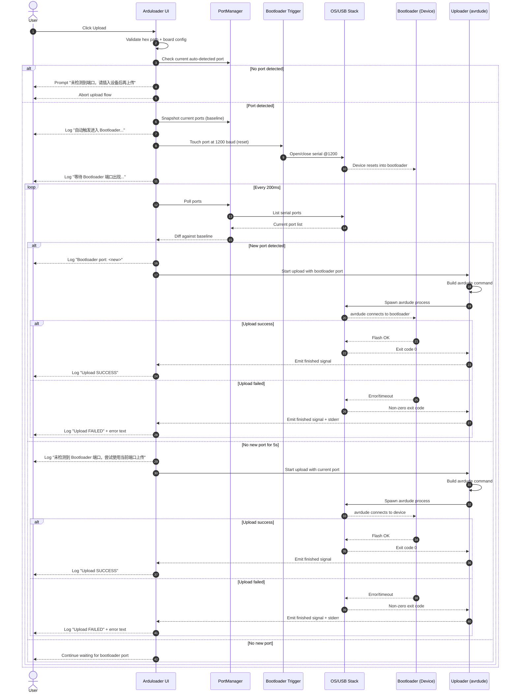

## Upload Sequence Diagram

```mermaid
sequenceDiagram
    autonumber
    actor User
    participant UI as Arduloader UI
    participant PM as PortManager
    participant BT as Bootloader Trigger
    participant OS as OS/USB Stack
    participant BL as Bootloader (Device)
    participant UP as Uploader (avrdude)

    User->>UI: Click Upload
    UI->>UI: Validate hex path + board config
    UI->>PM: Check current auto-detected port
    alt No port detected
        UI-->>User: Prompt "未检测到端口，请插入设备后再上传"
        UI-->>User: Abort upload flow
    else Port detected
        UI->>PM: Snapshot current ports (baseline)
        UI-->>User: Log "自动触发进入 Bootloader..."
        UI->>BT: Touch port at 1200 baud (reset)
        BT->>OS: Open/close serial @1200
        OS-->>BL: Device resets into bootloader
        UI-->>User: Log "等待 Bootloader 端口出现..."
        loop Every 200ms
            UI->>PM: Poll ports
            PM->>OS: List serial ports
            OS-->>PM: Current port list
            PM-->>UI: Diff against baseline
            alt New port detected
                UI-->>User: Log "Bootloader port: <new>"
                UI->>UP: Start upload with bootloader port
                UP->>UP: Build avrdude command
                UP->>OS: Spawn avrdude process
                OS-->>BL: avrdude connects to bootloader
                alt Upload success
                    BL-->>OS: Flash OK
                    OS-->>UP: Exit code 0
                    UP-->>UI: Emit finished signal
                    UI-->>User: Log "Upload SUCCESS"
                else Upload failed
                    BL-->>OS: Error/timeout
                    OS-->>UP: Non-zero exit code
                    UP-->>UI: Emit finished signal + stderr
                    UI-->>User: Log "Upload FAILED" + error text
                end
            else No new port for 5s
                UI-->>User: Log "未检测到 Bootloader 端口，尝试使用当前端口上传"
                UI->>UP: Start upload with current port
                UP->>UP: Build avrdude command
                UP->>OS: Spawn avrdude process
                OS-->>BL: avrdude connects to device
                alt Upload success
                    BL-->>OS: Flash OK
                    OS-->>UP: Exit code 0
                    UP-->>UI: Emit finished signal
                    UI-->>User: Log "Upload SUCCESS"
                else Upload failed
                    BL-->>OS: Error/timeout
                    OS-->>UP: Non-zero exit code
                    UP-->>UI: Emit finished signal + stderr
                    UI-->>User: Log "Upload FAILED" + error text
                end
            else No new port
                UI-->>User: Continue waiting for bootloader port
            end
        end
    end
```
