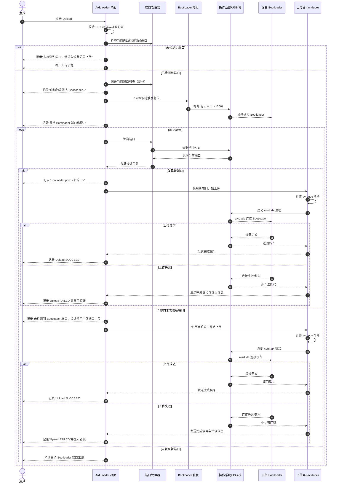

## 上传时序图（中文）

```mermaid
sequenceDiagram
    autonumber
    actor 用户
    participant UI as Arduloader 界面
    participant PM as 端口管理器
    participant BT as Bootloader 触发
    participant OS as 操作系统/USB 栈
    participant BL as 设备 Bootloader
    participant UP as 上传器 (avrdude)

    用户->>UI: 点击 Upload
    UI->>UI: 校验 HEX 路径与板型配置
    UI->>PM: 检查当前自动检测到的端口
    alt 未检测到端口
        UI-->>用户: 提示“未检测到端口，请插入设备后再上传”
        UI-->>用户: 终止上传流程
    else 已检测到端口
        UI->>PM: 记录当前端口列表（基线）
        UI-->>用户: 记录“自动触发进入 Bootloader...”
        UI->>BT: 1200 波特触发复位
        BT->>OS: 打开/关闭串口（1200）
        OS-->>BL: 设备进入 Bootloader
        UI-->>用户: 记录“等待 Bootloader 端口出现...”
        loop 每 200ms
            UI->>PM: 轮询端口
            PM->>OS: 获取串口列表
            OS-->>PM: 返回当前端口
            PM-->>UI: 与基线做差分
            alt 发现新端口
                UI-->>用户: 记录“Bootloader port: <新端口>”
                UI->>UP: 使用新端口开始上传
                UP->>UP: 组装 avrdude 命令
                UP->>OS: 启动 avrdude 进程
                OS-->>BL: avrdude 连接 Bootloader
                alt 上传成功
                    BL-->>OS: 烧录完成
                    OS-->>UP: 返回码 0
                    UP-->>UI: 发送完成信号
                    UI-->>用户: 记录“Upload SUCCESS”
                else 上传失败
                    BL-->>OS: 连接失败/超时
                    OS-->>UP: 非 0 返回码
                    UP-->>UI: 发送完成信号与错误信息
                    UI-->>用户: 记录“Upload FAILED”并显示错误
                end
            else 5 秒内未发现新端口
                UI-->>用户: 记录“未检测到 Bootloader 端口，尝试使用当前端口上传”
                UI->>UP: 使用当前端口开始上传
                UP->>UP: 组装 avrdude 命令
                UP->>OS: 启动 avrdude 进程
                OS-->>BL: avrdude 连接设备
                alt 上传成功
                    BL-->>OS: 烧录完成
                    OS-->>UP: 返回码 0
                    UP-->>UI: 发送完成信号
                    UI-->>用户: 记录“Upload SUCCESS”
                else 上传失败
                    BL-->>OS: 连接失败/超时
                    OS-->>UP: 非 0 返回码
                    UP-->>UI: 发送完成信号与错误信息
                    UI-->>用户: 记录“Upload FAILED”并显示错误
                end
            else 未发现新端口
                UI-->>用户: 持续等待 Bootloader 端口出现
            end
        end
    end
```
